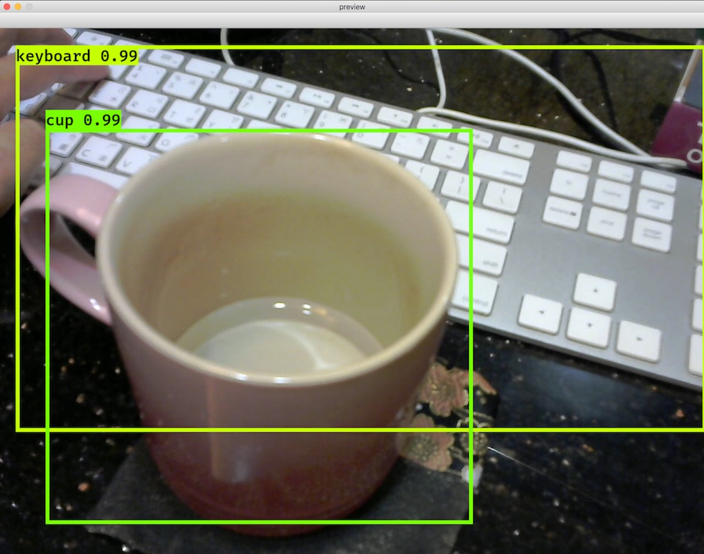

# yolo3-camera
Simple camera preview processed with Yolo3 

Work on Mac OS X and Linux.

## Credits

- [The original YOLO project](https://pjreddie.com/darknet/yolo/).
- [keras-yolo3 project](https://github.com/qqwweee/keras-yolo3/).

## Environment Setup

Required packages:
- Python 3.x
- Tensorflow
- Keras
- OpenCV / Numpy / PIL (Pillow) / matplotlib

### Create virtualenv 

It's recommended to install the packages inside `virtualenv` for being simpler and
easier to debug.

#### Mac OS

Install [Homebrew](https://brew.sh/) first.

> Note that Mac OS X is also bundled with Python 2.7 distribution. Make sure the Python
> executables you use are located in `/usr/local/bin`, which implies they're installed by Homebrew.

```console
# Default Python package of Homebrew is Python 3.x, not Python 2.7.
$ brew install python
$ which pip3
/usr/local/bin/pip3

$ pip3 install virtualenv
$ which virtualenv
/usr/local/bin/virtualenv

$ virtualenv env
$ . env/bin/activate
$ pip install --upgrade pip
```

#### Ubuntu 16.04

Default system-installed Python is Python 2.7. Don't try to change that. Create a virtualenv with
Python 3.x.

```console
$ sudo apt install python3-venv
$ python3 -m venv env
$ . env/bin/activate
$ pip install --upgrade pip
```

### Install related packages in virtualenv (OS X and Ubuntu):

```console
$ pip install tensorflow keras h5py opencv-python Pillow matplotlib
```

## Get the code

```console
$ git clone --recursive https://github.com/ctchuang/yolo3-camera.git
```

> Do not forget `--resursive` option.

## Prepare Yolov3-Tiny model

To prepare `vendor/keras-yolo3/model_data/yolo.h5`:

```console
$ cd yolo3-camera/vendor/keras-yolo3/

$ wget https://pjreddie.com/media/files/yolov3-tiny.weights
$ python convert.py yolov3-tiny.cfg yolov3-tiny.weights model_data/tiny_yolo.h5

$ cd -
```

## Run it

```console
$ python3 run.py [-h]
```

You should see live yolo result like below:


Press ESC key to exit.