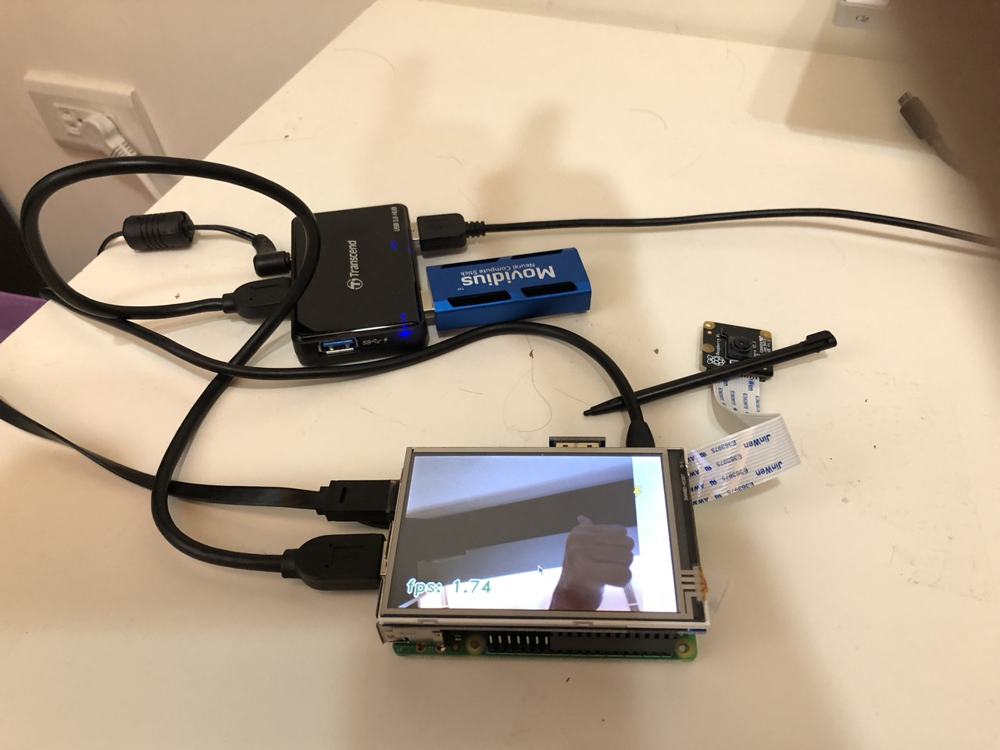

# yolo-camera

Encapsulates existing YOLO-based backend codebase to use YOLO model
on USB camera or Raspberry Pi camera input.

## Credits

- [The original YOLO project](https://pjreddie.com/darknet/yolo/).
- [keras-yolo3 project](https://github.com/qqwweee/keras-yolo3/).
- [YoloV2NCS project](https://github.com/duangenquan/YoloV2NCS)

## Get the code

```console
$ git clone --recursive https://github.com/ctchuang/yolo3-camera.git
```

> Do not forget `--resursive` option.

## Pick a backend

### 1. Keras_Yolo3

- Backend: Keras + Tensorflow
- Platform:
	- Mac OS X 
	- Ubuntu Linux
	- Remark:
		- Running on Raspbian hits Bus Error in TensorFlow. I didn't debug it.
- AI Model: `yolov3-tiny`
- AI Hardware:
	- Pure CPU
	- GPU (haven't tested)
- [Setup keras_yolo3 backend](doc/keras_yolo3.md)

### 2. YoloV2NCS

- Backend: Intel Movidius SDK
- Platform:
	- Ubuntu Linux
	- Raspbian (Raspberry Pi 3)
    - Remark:
        - Movidius NCS SDK doesn't support Mac OS.
- AI Model: `yolov2-tiny-voc`
- AI Hardware:
	- Intel Movidius NCS USB stick.
- [Setup YoloV2NCS backend](doc/yolov2ncs.md)

## Run it

Attach a USB camera or Raspberry Pi Camera.

```console
# Use Keras backend
$ python3 run.py -b 0 [-c camera_id]

# Use YoloV2NCS
$ python3 run.py -b 1 [-c camera_id]

# Get help
$ python3 run.py -h

```

You should see live yolo result like below:


It also works on Raspberry Pi 3 with Pi camera.


Press ESC key to exit.

### camera id

For USB camera:
```console
$ ls -l /dev/video*
```
For example, use `1` as camera id for `/dev/video1`.

For Raspberry Pi camera, use `pi` as camera id.

## Troubleshooting

### Test camera is working

```console
$ python3 test_camera.py -c [camera_id]
```

### Movidius NCS on Raspberry Pi 3

When using USB camera + Movidius NCS on Raspberry Pi 3 may have flakiness
because RPi3 only gets 12W. Adding a powered USB 3.0 hub can fix this.

## Known Issues

- Reading from Raspberry Pi camera to OpenCV is very slow. (<2FPS)
  - It works better with USB camera.

